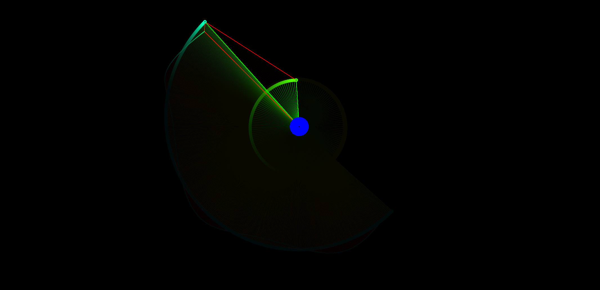

# 2D n-body particle simulation

A Javascript-based N-body simulation for calculating interactions between an arbitrary number of particles

## Features
- Adjustable simulation parameters
  - Physical constants, timestep, collisions, etc.
- Body tracking to visualize relative velocity
- Collisions
  - Elastic, inelastic, perfectly inelastic
- Forces
  - Gravity
  - Electrostatic
  - Spring (softbody approximation)
- Conservation laws
  - Momentum, energy, charge
- Various draw options
  - Trace paths
  - Color based on speed or charge
  - Gravitational field visualization (VERY SLOW)
    - Can show the Lagrange points
  - Center of mass indicator
  - Velocity, acceleration vectors
  - etc.
- Presets and generators
  - Planets
  - Planets with moons
  - Galaxy collision generator
  - Solar system generator
  - Binary system generator
    - Circular and non-circular
  - Momentum demonstrations
    - Newton's cradle
    - Calculate pi with collision count
  - Soft bodies (try hitting it with other objects)
    - Square grid
    - Hex grid
  - Many others
- Resonant orbit generator

### Physics principles
#### AP Physics 1
1. Kinematics
    - Position, velocity, acceleration - particle motion
2. Dynamics
    - Gravitational field (uniform acceleration)
    - Newton's laws
    - Spring forces (softbody)
3. Circular motion and gravitation
    - Gravity calculated based on Newtonian universal gravity
    - Centripetal force and acceleration - galaxies and other orbit generators
4. Energy
    - Conservation of energy
    - Gravitational potential energy
5. Momentum
    - Conservation of momentum
    - Elastic and inelastic collisions
6. Simple harmonic motion
    - Springs (softbody)
7. Torque and rotational motion Soon(tm)

#### AP Physics 2
3. Electrostatics
    - Electric force
    - Conservation of charge
    - Electric field and potential visualization Soon(tm)
5. Magnetism?
    - Magnetic fields and Lorentz force Soon(tm)?

## Controls
- U/V: toggle sidebar
- Arrows/WASD/Mouse: pan view
- Space: cycle tracked body
- Esc: cancel tracking
- Home/0: center viewport
- Scroll/Z/X: zoom in/out
- Others listed in control panel

## Issues
- Single core CPU-bound, very inefficient
  - Setting G to 1 helps with large numbers of bodies

## Planned
- EM forces
- Rotational tracking
- Torque and rotational motion implementation (?)
- Particle trajectory prediction
- Move calculations to gpu (especially field calcs)
- Implement optimized algorithms
- 3D version

## Image gallery
### Binary generator
Non-circular

Circular

### 2 planets and a moon orbiting a central body

With gravitational strength indicators (pause + trace on for long exposure effect)

### Colliding galaxy generator

### Resonant orbit generator
Inertial reference frame

Tracking inner body

Tracking outer body

7:12:17 resonance tracking outer body

### Soft body approximation
Pressure waves

Shockwaves at spring constant = 50

Shockwaves at spring constant = 100

Shockwaves at spring constant = 200

### Other interesting patterns
Hex grid preset, disable soft body and particle collisions, briefly enable gravity

